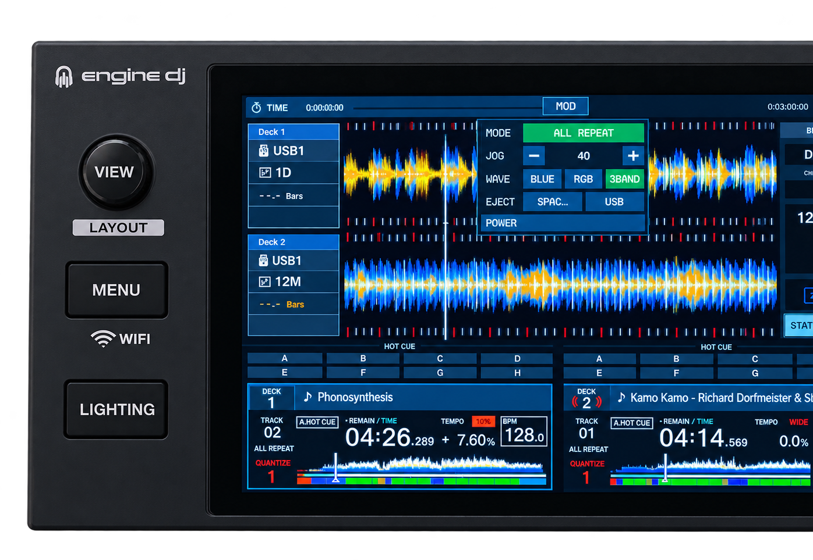

# rblive4 (spencercap's fork)

runs real rekordbox software on denon hardware.

see [CHANGELOG.md](https://github.com/spencercap/rblive4/blob/main/CHANGELOG.md) for how this is different from the [erhan's source](https://github.com/erhan-/rblive4). but briefly:
- ✅ BeatFX + knobs work 
- ✅ Loop encoders work
- 👾 added new MOD overlay panel for changing things previously unavailable (quantize on/off, safe eject USBs, etc)
- 🎛️ memory cues on SLIP + the pad page arrows, a hot cue countdown, and more: see [what this fork adds](#what-this-fork-adds)
- ⚡ screen runs at a locked 60 fps (was ~15), with an FPS readout in the MOD panel



---

[](https://instagram.com/i.erhan.es)

**Run the Pioneer DJ XDJ-RX3 *rekordbox* standalone player on a Denon DJ SC Live 4.**

rblive4 runs the ARM32 `rekordbox` player application (`rbp`, called `rb`
internally) extracted from **XDJ-RX3 firmware v1.20** on the **Denon DJ SC
Live 4** (`JP21` / internal name `SCX-4`, Rockchip RK3288, Engine OS).

The SC Live 4 shares its SoC, touchscreen controller, 800×1280 portrait panel,
MIDI control-surface architecture and Buildroot 2023.02.11 base with the Denon
Prime GO, so the design of the working Prime GO port carries over almost
unchanged.

> rblive4 is an **interoperability / preservation** project. It contains **no
> Pioneer/AlphaTheta firmware, no `rbp` binary, no Denon software and no
> rekordbox content.** You supply your own extracted assets. See
> [NOTICE.md](NOTICE.md).

---

## What this fork adds

New in this fork, on top of the port. **How to use each one: [docs/14 — Using the extras](docs/14-using-the-extras.md).**

| Feature | What it does | How to use it |
|---|---|---|
| MOD menu | on-screen settings panel: quantize, waveform colour, screen and LED brightness, eject USB, power off. Scrolls by dragging. | [use](docs/14-using-the-extras.md#the-mod-menu) · [ref](docs/08-controls.md#mod-menu) |
| Memory cues | **SLIP** stores one, the pad page **◄ ►** jump between them, **SHIFT + ◄** deletes | [use](docs/14-using-the-extras.md#memory-cues-slip-and-the-pad-page-arrows) · [ref](docs/08-controls.md#memory-cues) |
| Hot cue countdown | the deck info box counts to the next hot cue, in bars or beats | [use](docs/14-using-the-extras.md#the-hot-cue-countdown-deck-info-boxes) · [ref](docs/06-display.md#deck-info-panel) |
| Deck info rows | show or hide source, key, countdown and loop size; **INFO OFF** restores stock rbp | [use](docs/14-using-the-extras.md#the-hot-cue-countdown-deck-info-boxes) · [ref](docs/06-display.md#deck-info-panel) |
| My Tags | the track INFO panel lists every rekordbox My Tag as a scrolling button, the loaded track's in orange; **tap one to tag or untag the track** (written to the stick); MOD **TAGS** toggles it | [use](docs/14-using-the-extras.md#my-tags-in-the-track-info-panel) · [ref](docs/08-controls.md#my-tags-in-the-info-panel) |
| Beat meter | per-deck bar position or drift between decks, in the top bar | [use](docs/14-using-the-extras.md#beat-meter) · [ref](docs/08-controls.md#beat-meter) |
| SHIFT combos | SHIFT + pad deletes a hot cue, SHIFT + jog searches, SEARCH `<` `>` can beat-jump by the loop size | [use](docs/14-using-the-extras.md#shift-combos) · [ref](docs/08-controls.md#shift) |
| Touch Cue | touch a playing deck's overview to hear that point in the headphones, set a hot cue from a pad | [use](docs/14-using-the-extras.md#touch-cue) · [ref](docs/08-controls.md#touch-cue) |
| Track Preview | touch a browse row's mini waveform to audition it, with a playhead | [use](docs/14-using-the-extras.md#track-preview) · [ref](docs/08-controls.md#track-preview) |
| 60 fps display | locked 60 fps (was about 15), with an FPS readout in the MOD panel | [ref](docs/06-display.md#frame-rate) |

## What it does

| Subsystem | Detail | Doc |
|---|---|---|
| Display | 800×1280 portrait framebuffer, rotated, rekordbox UI full-screen | [docs/06](docs/06-display.md) |
| Touchscreen | ILI2117 capacitive, identity calibration installed in the chroot | [docs/07](docs/07-touch.md) |
| Controls | transport, deck, mixer, jog, pads, DJ / Sound Color FX, and the MOD menu | [docs/08](docs/08-controls.md) |
| Panel LEDs | PLAY / CUE / SYNC / KEY LOCK / VINYL / SLIP and FX LEDs mirror rbp's own LED state (blink included) | [docs/08](docs/08-controls.md) |
| VU meters | master L/R + channel 1/2 live levels | [docs/08](docs/08-controls.md) |
| Audio | master (XLR/RCA), headphones + cue, booth and built-in monitors on the JP21 8-channel codec | [docs/09](docs/09-audio.md) |
| USB | rekordbox-exported stick detection and `export.pdb` import into DeviceSQL | [docs/10](docs/10-usb.md) |
| Launcher | `start-rb.sh` stops Engine OS and brings up the player | [docs/11](docs/11-runtime-launcher.md) |
| Device access | persistent root SSH via the `/data` overlay (`freelive4` method) | [docs/01](docs/01-device-survey.md) |

## Limitations

* The speaker/booth level is fixed via `SPEAKER_GAIN`; the panel knob is not
  used.
* DJ FX parameter / layer encoders, StopTime and some shift actions are not
  mapped. Beat FX channel, type, TIME (beat/ms/BPM), ON, and the beat-loop
  encoder are mapped.
* Pad RGB colours and pad-mode LEDs are not driven.
* The RX3's other SHIFT combinations are not wired (see [SHIFT](docs/08-controls.md#shift)).
* Touch Cue audio is rough: the preview player has no VBR seek table for the deck's file. TODO.
* Autostart is not provided; the launcher is run manually.

---

## The idea

```
        XDJ-RX3 v1.20 assets (extracted externally)
                              │
       ┌──────────────────────┴───────────────────────┐
       │ pdj/rbp  (ARM32, soft-float)                 │
       │ + interoperability patches                   │  tools/patch-rbp
       └──────────────────────┬───────────────────────┘
                              │  rbp-audio
                              ▼
   Denon SC Live 4  ──  soft-float glibc-2.13 chroot  ──  rbp
        │                    ( /data/rbx3-run )
        │
        ├── display   : rebuilt DirectFB fbdev module (rotate + real fb format)
        ├── touch     : fbshim-tsc.so  (ILI2117 evdev → RX3 tsc2007 protocol)
        ├── controls  : knobshim2.so   (SC Live 4 MIDI → rbp keycodes + LEDs/VU)
        ├── audio     : audioshim.so   (JUCE/ALSA → hw:1,0 8-channel JP21 codec)
        ├── usb       : usb-watch.sh + native DeviceSQL import
        └── daemons   : edb_streamd
```

There is no emulation: the real `rbp` binary from the XDJ-RX3 firmware runs
directly, with a set of thin shims translating the SC Live 4's hardware into
what `rbp` expects.

## Why it works

The SC Live 4 is a Rockchip **RK3288** (ARMv7 hard-float) device running the
same `6.1.111-inmusic` kernel family and Buildroot 2023.02.11 userland as the
Prime GO. The subsystems `rbp` cares about match almost exactly:

* **Display** — `/dev/fb0` `rockchipdrmfb`, DSI 800×1280 portrait, 32 bpp,
  triple-buffered (virtual 800×3840).
* **Touch** — **ILI2117** capacitive, evdev `/dev/input/event0`.
* **Controls** — ALSA MIDI **"Control Surface"** (seq client 16, raw MIDI
  `midiC0D0`). Only the *mapping* differs (4-channel deck).
* **Audio** — `JP21` codec on `hw:1,0` with **8 playback channels**
  (S32_LE, 44.1 kHz).
* **Storage** — `/data` is a 5.9 GB ext4 partition with ~5.6 GB free.
* **Root access** — already persistent via the `freelive4` `/data` overlay +
  `/etc/ld.so.preload` method.

The real new work is the **control-surface MIDI map** (the SC Live 4's
buttons/pads/jog send different MIDI messages than the Prime GO) and the
**8-channel audio shim**.

---

## Repository layout

```
rblive4/
├── README.md                 you are here
├── TUTORIAL.md               build → deploy → run, end to end
├── NOTICE.md                 copyright / legal notes
├── LICENSE                   MIT (our code)
├── docs/                     findings & subsystem documentation (see docs/README.md)
│   ├── 00-overview … 12-troubleshooting
│   └── (survey, hardware, port plan, assets, chroot, display, touch,
│        controls, audio, usb, launcher, troubleshooting)
├── scripts/
│   ├── build-chroot.sh       host: assemble the soft-float chroot tarball
│   ├── patch-rbp-sclive4.py  SC Live 4-only rbp patch (getPcController)
│   ├── device/               scripts that run on the SC Live 4 (+ timeout.c)
│   └── shims/                LD_PRELOAD shims (soft-float, JP21) + Makefile
├── tools/
│   ├── patch-rbp/            shared rbp patch table (stock -> rbp-audio)
│   ├── build-directfb/       DirectFB 1.4.16 patch + build notes
│   └── touchdump.c           ILI2117 touch diagnostic
└── work/                     local scratch (gitignored)
```

## Quick start

Full instructions live in **[TUTORIAL.md](TUTORIAL.md)**. The short version:

```bash
# 0. prerequisites (WSL/Linux): arm-linux-gnueabi-gcc, python3, tar
#    extracted XDJ-RX3 assets (see docs/04-firmware-assets.md)

# 1. build the patched DirectFB stack (tools/build-directfb/README.md)
#    -> work/dfb/lib/...

# 2. build the soft-float chroot (rootfs + rbp-audio + shims + DirectFB
#    + directfbrc + touch calibration)
RX3=/path/to/extracted scripts/build-chroot.sh   # -> work/rbx3-run.tgz

# 3. deploy
scp work/rbx3-run.tgz root@<device>:/data/
ssh root@<device> 'mkdir -p /data/rbx3-run; zcat /data/rbx3-run.tgz | tar x -C /data/rbx3-run; chown -R root:root /data/rbx3-run'

# 4. ship the device scripts + run the launcher
scp scripts/device/* root@<device>:/data/
ssh root@<device> 'sh /data/start-rb.sh'
```

## What is *not* in this repo

To stay clean, rblive4 deliberately excludes:

* any `.UPD`, `.iso`, firmware image or `rbp` executable,
* Denon / Engine OS files,
* rekordbox music databases or media,
* any firmware key,
* downloaded firmware or decryption tooling (handled by the related projects),
* built binaries of the shims (build them from source).

## Related projects

rblive4 is one of several XDJ-RX3 `rb` porting projects. Firmware acquisition,
decryption and key handling are **out of scope** here; the separate **PrimeBox**
project (the Prime GO port) covers that pipeline, and **rb2go** / **chromebit**
explore other targets. Root-shell access to the SC Live 4 is covered by
**freelive4**. Obtain those projects separately.

## Credits

* Pioneer DJ / AlphaTheta — XDJ-RX3 and its GPL source distribution.
* Denon DJ / inMusic — SC Live 4 hardware.
* DirectFB, JUCE, ALSA and glibc maintainers.

See [NOTICE.md](NOTICE.md) for licensing details.
