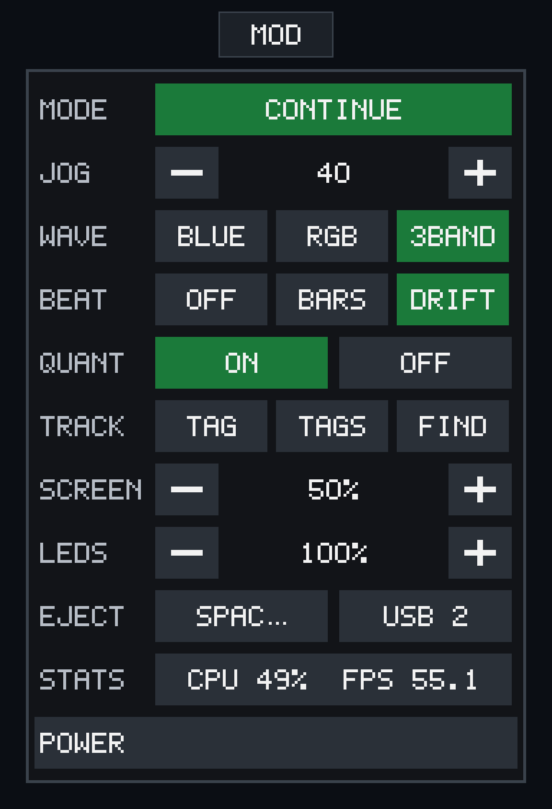
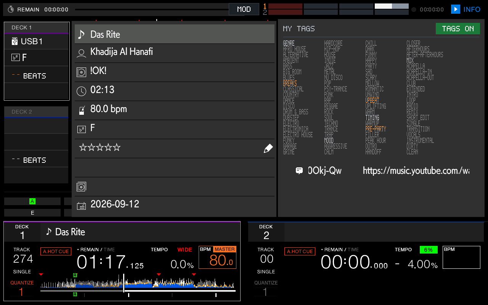
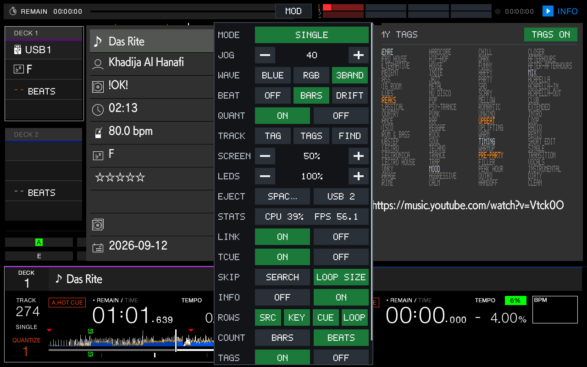
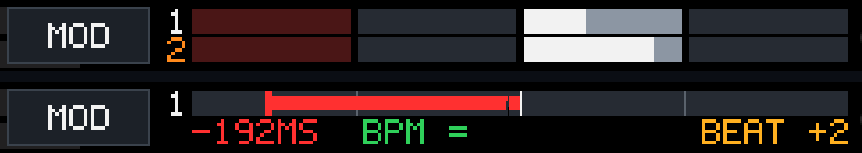

# 08 — Controls (SC Live 4 MIDI → rbp keycodes)

Transport, deck, mixer, jog, pads and DJ / Sound Color FX are mapped from the
SC Live 4's MIDI control surface onto rbp's key space, and rbp's LED and VU
state is mirrored back onto the panel.

## Source of truth

Engine OS defines every hardware control's MIDI identity in QML:

```
/usr/Engine/AssignmentFiles/PresetAssignmentFiles/JP21/JP21_Controller_Assignments.qml
/usr/Engine/AssignmentFiles/PresetAssignmentFiles/JP21/JP21_Controller_Device.qml
```

`JP21` is the SC Live 4 (internal name `SCX-4`). `knobshim2.c` is built from
these files. The SC Live 4 uses **channels 4/5 for the decks** and **15 for the
global/FX group**.

## MIDI layout (all channels 0-based)

| Surface | seq channel |
|---|---|
| Global (transport/FX/mix) | 15 |
| Deck Left / Right | **4 / 5** |
| Mixer strips **1 / 2** | 0 / 1 |

The SC Live 4 has **4 mixer strips**, but rbp is a **2-channel** mixer, so only
strips **1/2** are mapped (→ decks 1/2). Strips 3/4 are used for the
master-cue function instead (see below).

## MOD menu

A **MOD** tab at the top center of the screen opens this panel. It is taller than the screen, so drag inside it to scroll (a thin bar on its right edge shows where you are); a button acts when the finger lifts, unless the finger moved. Taps on the tab and the panel stay in the overlay. Tapping outside it closes the panel. Green marks the current play mode, waveform color, and quantize state.



| Row | What it does | rekordbox / XDJ-RX3 equivalent |
|---|---|---|
| **MODE** | Each tap cycles **SINGLE → CONTINUE → REPEAT → ALL REPEAT**. The choice is saved in `XdjSettings.dat`. | Utility play mode, `UiSetUtilAutoPlayMode` |
| **JOG** | Jog sensitivity for both decks. **−** and **+** step by 10% between 20% and 200%. It starts at 40% of the original wheel calibration and lasts until reboot. | No RX3 key. The shim scales each jog step. |
| **WAVE** | Waveform color: **BLUE**, **RGB**, or **3BAND**. | Waveform color setting (`CmnFunc` waveform color 1 / 3 / 4) |
| **BEAT** | The beat meter in the top bar, right of the MOD tab. **OFF**, **BARS** (default), or **DRIFT**. See [Beat meter](#beat-meter). Lasts until reboot. | No RX3 equivalent. The RX3 marks downbeats only with the small red ticks over each waveform. |
| **QUANT** | **ON** or **OFF** for both decks. **OFF** lets cue land off the beat grid. | The QUANTIZE button, `UiSetQuantizeOnOff`. The settings entry "quantize beat value" only changes the grid size and leaves snapping on. |
| **TRACK** | **TAG** adds the highlighted browse track to the Tag List. **TAGS** opens the Tag List. **FIND** opens Search, the screen with the on-screen keyboard. TAGS and FIND close the panel so that screen is visible. | **TAG** is Tag Track (`0x420e`, `UiKey_AddTag`). **TAGS** is TAG LIST (`0x0203`). **FIND** is SEARCH (`0x0205`). |
| **SCREEN** | Screen backlight. **−** and **+** step by 10% between 10% and 100% of `max_brightness`. The first look shows what Engine OS left it at. It never goes fully dark, since the screen is the only way to turn it back up. Lasts until reboot. | No RX3 key. fbshim writes `/sys/class/backlight/mipi-backlight/brightness`. |
| **LEDS** | Panel LED brightness, 10% to 100% in 10% steps, default 100%. Button LEDs get Note On velocity `127 × percent`. Pads scale each colour channel before the 2-bit squash, and a lit channel never drops to off. A change re-sends every LED. Lasts until reboot. | No RX3 key. knobshim reads `led_pct` from `/tmp/rb-overlay` on its 20 Hz LED tick. |
| **EJECT** | Both USB slots are shown, labeled with a shortened volume name. The first tap on a slot shows **YES**. The **YES** tap ejects that stick. | No RX3 key. `usb-watch.sh` releases the mount. |
| **STATS** | Read-only, for example `CPU 38%  FPS 60.4`. **CPU** is the busy share of all 4 cores over the last second (`/proc/stat`). **FPS** is displayed frames per second, counted at each `FBIOPAN_DISPLAY` ([06](06-display.md#frame-rate)). Updates while the panel is open. | No RX3 equivalent. |
| **LINK** | **ON** (default) or **OFF**. This is the RX3's LINK CUE button for Track Preview: while ON, touching a track's mini waveform in the browse list plays it from that point into the headphones. The overlay re-applies it about once a second because rbp resets it at startup. Kept in `/tmp/rb-overlay`. | LINK CUE (`0x4408`), `MixerEngine::setPreviewChHeadphoneCue` |
| **TCUE** | **ON** (default) or **OFF**. Touch Cue on the deck overview waveforms, see [Touch Cue](#touch-cue). **OFF** removes the touch area completely: the touch handler returns on its first check and the overview is back to rbp's Needle Search. Kept in `/tmp/rb-overlay`. | No RX3 equivalent. CDJ-3000X Touch Cue. |
| **SKIP** | What the deck **SEARCH < >** buttons do. **SEARCH** (default): rbp's scan, hold to search. **LOOP SIZE**: each press beat-jumps the deck back or forward by the deck's beat-loop size, the one the loop encoder is set to (128, 64, 32, 16, 8, 4, 2, 1 beats; 1/2 or smaller jumps 1/2 a beat). Lasts until reboot. | SEARCH REV / FWD (`0x4120` / `0x411f`), or `DjEngineIF::playBeatJump` |
| **INFO** | **ON** (default) or **OFF**. **OFF** leaves the DECK 1 / DECK 2 info boxes left of the waveforms to rbp: the source row shows again and Bars counts to the next memory cue. The shim's hooks then return on their first check. See [06](06-display.md#deck-info-panel). | No RX3 equivalent. |
| **ROWS** | With INFO **ON**: which rows of those boxes are shown: **SRC** (where the track came from, "USB1"; off by default), **KEY**, **CUE** (the countdown to the next hot cue), **LOOP** (loop size). Green = shown. A hidden row stays an empty strip. | No RX3 equivalent. |
| **COUNT** | The unit of the **CUE** row: **BARS** (default, `bars.beats` such as `02.3`) or **BEATS** (a plain beat count up to 99, such as `11`, labelled BEATS). | No RX3 equivalent. |
| **TAGS** | **ON** (default) or **OFF**. ON lists every My Tag in the right half of the track INFO panel, in place of the artwork area, with the loaded track's tags in orange. OFF leaves that area to rbp. The same switch is the button at the top of that list. See [My Tags](#my-tags-in-the-info-panel). | No RX3 equivalent. |
| **POWER** | Always the last row. The first tap shows **YES**. The **YES** tap ejects both sticks, then powers the unit off. Closing the panel before **YES** cancels it. | No RX3 key. The launcher handles the shutdown. |

### Track Preview


Touch the mini waveform (PREVIEW column) of a browse or Tag List row: the track plays from that point, dragging seeks, and lifting stops. A lime playhead follows it along the waveform. It is audible in the headphones only, so turn the cue MIX knob toward CUE. The touch area is x 109 to 327 (Tag List: x 10 to 228), y 102 to 702, in 50 px rows. It needs the MOD **LINK** row ON, which is the RX3's LINK CUE button. The rest of this section is what `knobshim2` and the overlay add, because rbp does not do it on this port:

* **Message-thread check.** `ui::PlayerPreview::loadPreview`, `setPreviewPosition` and `unloadPreview` return early when `PanelComPeerLinux::isOnMessageThread()` is true, and the startup patch at `0x3664b4` forces it true. A hook on `isOnMessageThread` answers false only to callers inside those three functions (by return address).
* **Touch filter.** rbp passes every touch sample through `TouchAdValueHysteresis::procAdaptValue`, which is tuned for the raw ADC counts of the RX3's resistive panel (bands of 50 and 100). This port feeds it pixels, so a slow drag crept one pixel per five samples and then jumped about 100 px, and the middle of a waveform could not be reached. A hook divides the four bands by 4. This filter sits in the player's touch input generally, so it applies to every drag.
* **Seek throttle.** A drag sends a Seek per pixel and each one is a real file seek, while the engine ignores moves under 3%. A hook forwards a seek only after a move of 2% and at most every 100 ms.
* **Playhead.** rbp reports only load and unload to the list, never a position, so the overlay paints the line after the rotate, on each of the three fb pages, and puts the pixels under it back on the next frame. The position is the preview player's own frame counter (the one `PlayEngine::getPlayingTime` reads for channel 2) over `PlayerPreview::getTotalLength()`. The line, the row geometry (windows 200x38 at x 119, y = 110 + 50 x row) and the shared painter cost nothing while no preview is running.
* **LINK.** rbp resets `MixerEngine::setPreviewChHeadphoneCue` to off at every start, and the SC Live 4 has no button for it, so the overlay re-applies the MOD setting about once a second.

### Touch Cue


On the CDJ-3000X you press a deck's waveform to listen to that point in the headphones. The RX3 firmware has nothing like it (its Needle Search jumps the deck, and only while paused), so it is built here from the preview player.

* **Use.** With the TCUE row ON and a deck playing, touch and hold that deck's overview waveform, the small one at the bottom of the deck panel (deck 1: x 106, deck 2: x 744, each 513 wide, y 718 to 779, the player's own Needle Search areas). The deck's own track plays from that point in the headphones while the deck keeps playing. Move the finger to move the point, lift to stop. A lime playhead shows it. A paused deck is left to rbp's Needle Search.
* **How.** Each deck's `playengine::Player` keeps a copy of its `StTrackInfo` at `+1988` (`Player::load` memcpy's it there), and `DjEngineIF::loadPreview` takes that type, so no database lookup is needed. The copy's owned heap blocks (`+804` to `+839`, the beat grid and VBR table with their sizes) were already freed, so they are cleared. Sharing them made the two players free the same memory and killed rbp.
* **Hot cue.** While a Touch Cue is held, pressing a pad of that deck (notes 15 to 22) sets hot cue A to H at the previewed time, through `DjEngineIF::setMemoryCueTime` (cue types 1 to 8, `StCueInfo+792` the in-point in ms, `+804` = `0xffffffff` for no loop end). The pad press and its release are not passed to rbp. rbp's own pad handler is deliberately not used for this: it records the cue through `Player::recHotCue`, which stalls the playing deck's reader for a moment when the point is far from the playhead. The engine call does not.
* **Pad LED.** The LED belongs to rbp's UI, which lights it only from its own pad handler. After the engine call the overlay replays that handler's UI steps on the paint thread: `ui::Player::updateHotCueLedState`, `updateOwnSavingHotCueLedColor`, then the colour bytes copy. The deck's `ui::Player` is picked up by a hook on `checkHotCueLedState`, which rbp runs for every pad refresh.
* **Cost.** TCUE OFF returns on the first check of the touch handler. When no Touch Cue or preview is running, the playhead painter and the LED job return on a single comparison per frame.
* **Known limit.** The preview audio is rough (glitchy). The preview player has no VBR seek table for the deck's file, because the deck's copy was cleared, and fetching it from the database by track ID is not done yet. TODO.

### My Tags in the INFO panel



rbp has the My Tag data but its INFO panel (the **INFO** button, top right) has no tag row, and the artwork area on its right is empty on this port. While the panel is open, the overlay covers that area with **every tag on the stick**, grouped under their categories (Genre, Mood, Timing, Mix, ...), with the **loaded track's tags in orange** and the rest grey. At the top right of the area a **TAGS ON / OFF** button turns the list off (it leaves rbp's artwork area and a small TAGS OFF button to turn it back on). MOD row **TAGS** is the same setting.

The MOD menu stays on top: while it is open the list moves to the right of it.



* **Where the tags come from.** The stick's `PIONEER/rekordbox/exportExt.pdb`, a DeviceSQL file with the same page layout as `export.pdb`. Its type 3 table holds the tags and the categories (rows start `80 06`; category id at row +12, position at +16, tag id at +20; the name is at +32, its length byte at +31 is 2 × length + 3; a category row has +12 = 0) and its type 4 table holds one row per assignment (track id u32 at +4, tag id u32 at +8). Pages are found through the table directory at file offset 28 and followed by their next-page link at +12. A tag that appears on several pages (stale copies) is shown once.
* **Which track.** `knobshim2` asks rbp for each deck's loaded track (`CmnFunc_CmnInfo_GetLocalNowPlayMusicID`, the id is the u32 at +4, the same id as the stick's `export.pdb`) twice a second and writes it to `info_track[]` in `/tmp/rb-overlay`. The overlay uses deck 1's, or deck 2's when deck 1 is empty. The INFO panel itself shows the active deck's track, which this does not follow.
* **When it is drawn.** Only while the INFO button at the top right is lit (the overlay reads that pixel, since rbp has no flag for it). The list is painted once per fb page and change, not every frame: rbp redraws nothing in that area while the panel is open, so the driver leaves the pixels alone. Closing the panel or switching the list off forces one full redraw so rbp's pixels come back. Drawing every frame flickered against the MOD menu and cost about 0.05 of a core; painting once costs nothing measurable (60 fps held).
* **Text.** The overlay's built-in 5x7 font is upper case only (`& / '` added), so tags are shown in capitals, drawn 1 pixel wide and 2 tall per font pixel so the whole list fits (4 columns). A letter the font has no shape for is left blank. Up to 160 tags and categories, 27 characters each.

### Beat meter



Both views use the blank part of the top bar between the MOD tab and the recording timer (x 690 to 1072). Deck 1 is the top row and deck 2 is the bottom row, on the same x scale, so you compare positions straight down.

**BARS** shows one bar, 4 beats, per deck. The current beat lights up and fills left to right as the beat passes. Beat 1 (the downbeat, a red tick in rbp's waveform) is red. When two decks are in phase, their fill edges sit on the same x. When their downbeats also line up, the same cell is lit in both rows. The deck number is orange on the sync master and grey when the deck has no beat grid.

**DRIFT** compares the other deck with a reference deck. The reference is the sync master, or deck 1 when there is none. The top row is a center-zero gauge spanning half a beat either side. A block right of center means the other deck is ahead, so slow it down or nudge the jog back. The bottom row shows:

* the offset in ms (`+12MS`). It is green within 8 ms, amber within 30 ms, and red beyond that.
* the tempo difference (`BPM +0.40`, or `BPM =` within 0.05 BPM).
* `BEAT +1` (or `-1`, `+2`) when the beats line up but the downbeats do not.

The phase is wrapped to half a beat, so a mix that is a whole beat off still reads as locked, with `BEAT` showing the difference.

How it reads the grid: `PlayEngine::getBeatPosInfo(ch)` (`0x5f5bc`, through the PlayEngine pointer at `0x011497d0`) returns a `common::BeatPosition`. Its beats are a vector of 8-byte entries at `+52` / `+56`, each holding the beat in bar (1–4, u16), BPM ×100 (u16), and time in ms (u32). The grid offset is at `+40`. Each frame the overlay finds the beat at `getPlayingTime(ch) − offset`, the same lookup the engine's `Quantize` code does, and computes the bar position from it. It only reads. The engine's own `Quantize::calc*Beat*` helpers write into the `BeatPosition`, so the overlay does not call them. Live BPM is the grid BPM × (1 + `getTempoX100` / 10000). `/tmp/rb-beat` logs both decks once a second while the meter is on, along with the slowest meter paint in µs (about 300 µs).

The meter is painted on every frame, after the rotate and before the pan. rbp's pixels under it are black and unchanged, so the driver's unchanged-tile skip leaves the meter alone. When the meter is turned off, its last frame stays until the panel closes. Closing the panel forces a full redraw, which clears it.

## Browse buttons

These are the SC Live 4 buttons that stand in for the XDJ-RX3 browse keys. A hold is about 600 ms. The short tap is sent only after the button is released, so a hold does not also fire the tap.

| SC Live 4 | Gesture | rekordbox / XDJ-RX3 |
|---|---|---|
| **VIEW** (note 14) | tap | **BROWSE** (`0x0202`) |
| **MENU** (note 13) | tap | **MENU** (`0x0206`) |
| **LIGHTING** (note 39) | tap | **TAG LIST** (`0x0203`). Same as MOD **TAGS**. |
| **LIGHTING** | hold | **SEARCH** (`0x0205`), the browse screen with the on-screen keyboard. Same as MOD **FIND**. |
| **FWD** (note 4) | tap | **SOURCE** (`0x0201`). While the Source menu is open and a rekordbox stick is mounted, the tap is **USB1** (`0x0209`) instead, which opens that drive. |
| **FWD** | hold | **TAG TRACK** (`0x420e`). Adds the highlighted browse track to the Tag List. Same as MOD **TAG**. |
| **BACK** (note 3) | tap | **BACK** (`0x420d`) |
| Browse knob push (note 6) | tap | **SELECTOR** (`0x420c`). In the Source menu with a mounted stick, the push is **USB1**, same as a short FWD tap there. |
| Browse knob turn (CC 5) | turn | Selector rotate |

LIGHTING is the unused button under MENU. It has no Engine OS action in this port. VIEW is the button above MENU.

## Mapping table (as built in `scripts/shims/knobshim2.c`)

### Global (ch 15)

| Control | MIDI | rbp keycode |
|---|---|---|
| LOAD deck 1 / 2 | note 1 / 2 | `0x4311` K_LOAD (deck 1 / 2) |
| BACK | note 3 | `0x420d` K_BACK |
| FWD | note 4 | short tap `0x0201` K_SOURCE (USB1 while the Source menu is open); hold (~600 ms) `0x420e` K_TAGTRACK, adds the highlighted track to Tag List |
| Browse knob push | note 6 | `0x420c` K_SELECTOR |
| Browse knob turn | CC 5 | `0x420c` rotate |
| MENU | note 13 | `0x0206` K_MENU |
| VIEW | note 14 | `0x0202` K_BROWSE |
| **LIGHTING** | note 39 | short press `0x0203` K_TAGLIST; hold (~600 ms) `0x0205` K_SEARCH (on-screen keyboard) |
| Crossfader | CC 14 | `0x6017` K_XFADER |
| Main Vol | CC 20 | `g_master_gain` — audioshim, **ch0/1 (XLR) only** |
| Speaker/booth level | CC 15 | `g_speaker_gain` — audioshim, **ch6/7 (built-in monitors)** |
| Speaker on/off switch | note 41 | `g_speaker_on` — gates ch6/7 |
| Split cue switch | note 11 | `HeadPhone::setStereoType` (0 = split, 1 = stereo) |
| Cue mix | CC 18 | `0x4405` K_HPMIX → rbp `HeadPhone` mix rate |
| Cue level | CC 19 | `0x4406` K_HPLEVEL → rbp headphone level |
| Sound Color FX: DualFilter / DubEcho / Noise / Wash | notes 21–24 | `0x50a6`/`0x50a2`/`0x50a4`/`0x50a3` (both channels) |

### Deck (ch 4 = left → deck 1, ch 5 = right → deck 2)

| Control | MIDI | rbp keycode |
|---|---|---|
| CENSOR → **loop exit** | note 1 | `0x410e` K_RELOOP (exits a running loop; re-enters a stored one) |
| SYNC | note 8 | `0x4112` K_SYNC (LED mirrored back on note 8) |
| CUE | note 9 | `0x4102` K_CUE |
| PLAY / PAUSE | note 10 | `0x4101` K_PLAY |
| Pad mode CUES/STEMS | note 11 | `0x4113` K_HOTCUE |
| Pad mode LOOPS/AUTO | note 12 | `0x4114` K_ALOOP |
| Pad mode ROLL/SAMPLER | note 13 | `0x4115` K_SLIPLOOP |
| Pad mode SLICER | note 14 | `0x4116` K_BEATJUMP, **page 2 first**: entering beat jump from another pad mode sends the key a second time, so BEAT JUMP 2 (1/2, 2, 4, 16) opens first and the next press goes to BEAT JUMP (1, 2, 4, 8). rbp flips its page on every press of the key while already in beat jump |
| Pads 1–8 | notes 15–22 | `0x4117`–`0x411e` |
| Pitch bend − / + | notes 29 / 30 | `0x4107` TEMPO RANGE / `0x4108` MT |
| Jog touch | note 33 | `0x4306` |
| Jog rotate | CC `0x11` hi + `0x31` lo (14-bit) | `0x4305` |
| Key lock | note 34 | `0x4108` K_MT |
| VINYL | note 35 | `0x4104` |
| SLIP | note 36 | **memory cue**: `0x4125` K_CUEMEMORY stores a memory cue at the playhead. SHIFT + SLIP is the old `0x4110` slip mode. See [Memory cues](#memory-cues) |
| Pad page ◄ / ► | notes 23 / 24 | **memory cue call**: `0x4323` / `0x4322` jump to the previous / next memory cue. SHIFT + ◄ is `0x4124` K_CUEDELETE |
| Loop in / out | notes 37 / 38 | `0x410c` / `0x410d` |
| Auto loop push / turn | note 39 / CC 32 | `0x4114` |
| Pitch fader | CC `0x1F` hi + `0x4B` lo (14-bit, invert) | `0x4109` K_TEMPO_SLIDER |

### Mixer (strips 1/2 → decks 1/2)

| Control | MIDI | rbp keycode |
|---|---|---|
| TRIM | CC 3 | `0x5019` |
| HI | CC 4 | `0x501a` |
| MID | CC 6 | `0x501b` |
| LOW | CC 8 | `0x501c` |
| Channel fader | CC 14 | `0x501e` |
| Sweep FX knob | CC 11 | `0x509d` K_COLOR |
| **PFL / cue (strips 1/2)** | note 13 | drives `MixerEngine::setMixerChHeadphoneCue` **directly** (rbp has no PFL keycode); LED mirrored on note 13 |
| **Master cue (strips 3/4)** | note 13 | drives `MixerEngine::setMasterOutHeadphoneCue` (SC Live 4 has no MASTER CUE button); LEDs mirrored |

### DJ FX (global ch 15)

| Control | MIDI | rbp |
|---|---|---|
| FX activate | note 26 | `0x448d` K_BFX (LED = LedStat 48, blinks while active) |
| Wet/dry knob | CC 4 | `0x448f` K_DEPTH |
| **Channel assign** | **note 40**, velocity = position | `0x448c` K_BFXCH plus `DjEngineIF::setBeatEffectSelectChannel` |
| **Effect select** | **CC 35**, relative (1 = +1, 127 = −1) | `0x448b` K_BFXTYPE |
| **TIME encoder turn** | **CC 36**, relative | depends on encoder mode (below) |
| **TIME encoder push** | **note 25**, short tap | cycle encoder mode: **BEAT → TIME → BPM** |
| **BEAT < / >** | hold **note 25** (or SHIFT) + turn CC 36 | `0x4490` / `0x4491` (momentary, any mode) |
| **FX SELECT tap** | **note 30**, short tap | `DjEngineIF::triggerTapTiming()` |
| **FX SELECT hold** | **note 30** held ~600 ms | return Beat FX BPM to **AUTO/quantize** |

#### Channel assign

The panel sends the position as the **note-on velocity of note 40**
(`DJFxAssign { turnCC: 40; velocities: [0,1,2,3,127] }` =
`['Channel3','Channel1','Channel2','Channel4','Main']`). rbp's
`djengine::c_str(EnBeatEffectSelectChannel)` gives the target values:

```
0 = PLAYER_0   1 = PLAYER_1   2 = MIC_0   3 = ASSIGN_A
4 = ASSIGN_B   5 = MASTER     6 = AUX
```

So: **Ch1 → 0, Ch2 → 1, Main → 5**. Ch3/Ch4 are inert — rbp has only two
players, so there is nothing to route them to.

The UI key (`K_BFXCH`, OP_VALUE) updates the on-screen channel indicator.
The audio route is applied with `DjEngineIF::setBeatEffectSelectChannel`
(`0x4d264`) as well, because the OP_VALUE payload from a MIDI velocity
does not always change the engine assignment.

#### Effect select

`onEv_BeatEffectType(SW_BFX_TYPE)` is a **14-position switch** whose positions
map to internal effect types:

```
pos:  0  1  2  3  4  5  6  7  8  9 10 11 12 13
type: 6  5 13  7 14  1  4  9 10  2  3 12  8 11
```

rbp's panel encoder is endless, so the shim keeps a cursor over the 14
positions, seeds it from the current effect (`getBeatEffectType()` inverted
through the table above), and sends the position as `K_BFXTYPE`.

#### TIME encoder modes (BPM / ms / beat)

The on-screen Beat FX row shows **BPM**, **time (ms)**, and **beat fraction**.
A short push of the TIME encoder (note 25) cycles which of those the
encoder turn (CC 36) edits. The default is **BEAT**.

| Mode | Turn CC 36 | rbp |
|---|---|---|
| **BEAT** | BEAT `<` / `>` | `0x4490` / `0x4491` OP_PRESS |
| **TIME** | delay/parameter in ms | `0x448e` K_TIME, OP_ROTATE |
| **BPM** | whole-BPM step | `setBfxBpmDetectMode(TAP)` then `adjustBfxBpm(false, ±1)` |

Hold TIME (or SHIFT) and turn still forces BEAT `<` / `>` without changing
the stored mode.

A short tap of **FX SELECT** (note 30) calls `DjEngineIF::triggerTapTiming()`.
The first tap enters manual/TAP mode and starts the engine's timer. Later taps
calculate the BPM and refresh the green TAP display. The RX3 TAP key is not
synthesized: its press edge forces AUTO before the release can record a tap.

Hold **FX SELECT** (note 30) for 600 ms to return Beat FX BPM to
**AUTO/quantize** after changing BPM manually. This lets rbp use the live,
pitch-adjusted BPM and restore the on-screen QUANTIZE state. The SC Live 4
lacks the RX3 mixer-hardware state that MAIN normally uses to identify its
source deck. When that native lookup fails, the shim follows rbp's sync-master
deck and calculates its current BPM from the analyzed BPM and live tempo
offset. The release path also checks elapsed hold time, avoiding a race at the
threshold.

`onEv_BeatFxTime` → `BeatFxTimeKnob(value, absolute)` is called with
**absolute = false**, so the argument is a **rotation delta**, not a position —
rbp itself steps and clamps it (it adds `value * 13` to the current percent).

**Op codes matter here.** `ui::Mixer::asEventCode` maps
`0x448e → 0x2014` (any op), but gates the BEAT buttons:

```
0x4490 -> 0x2015   and   0x4491 -> 0x2016   only when (op & 0xf) == 0
```

so they are sent with **OP_PRESS**.

### Memory cues

The deck SLIP button and the pad page arrows (Parameter ◄ ►, notes 23 / 24) drive rbp's own memory cue keys, so rbp does the rest: it stores the cue in the track's database on the stick, draws the red ▼ marker on the waveform and overview, and counts to it in the Bars row when INFO is OFF.

| Button | Does | rbp key |
|---|---|---|
| **SLIP** | Stores a memory cue at the playhead | `0x4125` "CueMemory" |
| **◄** (note 23) | Jumps to the previous memory cue | `0x4323` |
| **►** (note 24) | Jumps to the next memory cue | `0x4322` |
| **SHIFT + ◄** | Deletes the memory cue at the playhead | `0x4124` "CueDelete" |
| **SHIFT + SLIP** | Slip mode, as SLIP was before | `0x4110` |

The call keys are the reverse of what their names in rbp's key table suggest; checked on the unit. A jump past the last or first cue does nothing. Hot cues and the Bars countdown (which counts to hot cues unless INFO is OFF) are separate.

### Beat-loop encoder

The RX3 has no beat-loop knob (its pads trigger loops). On the SC Live 4 the
per-deck encoder (CC 32) and its push (note 39) drive
`DjEngineIF::setAutoBeatLoop` / `exitLoop` directly, gated by `BEATLOOP=1`
(the launcher sets that). Pad mode is not used: sending pad keys while rbp
was in CUES could fire a hot cue.

Push **toggles** a latched loop (mode 0). Performance-pad mode 1 kept a slip
timeline, so exit jumped forward in the track. `exitLoop(ch, false, false)`
matches rbp's RELOOP/EXIT path.

Turn selects length. Default is **16 beats**. Range:

**128, 64, 32, 16, 8, 4, 2, 1, 1/2, 1/4, 1/8, 1/16, 1/32**

If a loop is already running, a turn applies the new length immediately.

The pad-mode size tables below are still what rbp uses for its LOOP pads:

| selector | 8 sizes |
|---|---|
| pad mode 1, `[this+0x7a] == 0` | **4, 2, 1, 1/2, 1/4, 1/8, 1/16, 1/32** |
| pad mode 1, `[this+0x7a] != 0` | 4/3, 1, 2/3, 1/3, 1/5, 1/6, 1/7, 1/9 |
| pad mode 2 (SLIP) | 16, 8, 4, 2, 1, 1/2, 3, 4/3 |

### Not mapped

* Layer (31), StopTime (CC 37), Thru (note 15) — no
  direct rbp keycode, or needs a distinct param.
* SHIFT (note 28 per deck) does four things, see [SHIFT](#shift). Every other
  RX3 SHIFT combination is not wired.
* Pad-mode LEDs (11–13) and pad colours.

### SHIFT

The SC Live 4's SHIFT (note 28 on each deck) is not forwarded to rbp as a held key. The shim tracks it (`shift_down`) and uses it for:

| With SHIFT | Does | How |
|---|---|---|
| a hot cue pad | deletes that hot cue | rbp's SHIFT key `0x4103` is sent around the pad press only, so rbp's own pad handler does the delete (engine, database, LED) |
| the jog wheel | search | the shim drives `DjEngineIF::startScan`, see [Key gestures](#key-gestures-added-by-the-port) |
| the Beat FX TIME encoder | BEAT `<` / `>` in any encoder mode | see [TIME encoder modes](#time-encoder-modes-bpm--ms--beat). In the default BEAT mode a plain turn already does it, so SHIFT shows only in the TIME and BPM modes. |

Forwarding SHIFT to rbp all the time would turn on every shift function rbp has, which is untested here. The RX3's other SHIFT combinations (for example SHIFT + LOOP IN, which restarts a running loop) are not wired.

## LED output (SC Live 4 panel)

Transport LEDs mirror the engine: PLAY / CUE / SYNC / KEY LOCK / VINYL / SLIP,
both decks.

### How the SC Live 4 drives its LEDs

Every front-panel LED is **MIDI**: Engine OS sends `Note On`/`Note Off` to
the *Control Surface* — rawmidi `hw:0,0` (`/dev/snd/midiC0D0`), or seq
`16:0` from the sequencer side. Velocity encodes colour/brightness
(`(r<<4)|(g<<2)|b`, 2 bits per channel; `0x7F` = bright for the simple
transport LEDs, `Note Off` = dark).

```sh
aplaymidi -p 16:0 ledtest.mid      # note8/9/10 ch4 -> SYNC/CUE/PLAY light up
amidi -p hw:0,0 -S "94 0A 3F"      # PLAY deck1 bright
```

Writing LED MIDI does **not** loop back into the Control Surface input path
(verified with `aseqdump -p 16:0`), so it is safe to do from inside `rbp`.

### The bridge (`knobshim2.so`)

rbp computes its LED state into `uif::LedStat` and encodes it for the
XDJ-RX3's EUP/SUB micons, sent to `/dev/subucom_spi1.0` — a dead FIFO in this
port. `led_thread()` therefore polls rbp's own engine state at 20 Hz through the
`playengine::PlayEngine` singleton and mirrors it onto the JP21 notes:

| LED | note (ch 4/5) | source |
|---|---|---|
| SYNC | 8 | **rbp LedStat id 4** (off / solid / blink) |
| CUE | 9 | loaded && !playing |
| PLAY | 10 | `isPlaying` → solid; loaded && !playing → blink; else off |
| KEY LOCK | 34 | `PlayEngine::isMasterTempo(ch)` |
| VINYL | 35 | `PlayEngine::isVinylMode(ch)` |
| SLIP | 36 | `PlayEngine::isSlipModeOn(ch)` |
| LOOP IN | 37 | derived (rbp's loop ids arrive on channel 0) |
| LOOP OUT | 38 | derived (`isLooping`) |
| AUTO LOOP | 39 | `isAutoBeatLoop(ch)` |

Deck 1 = PlayEngine channel 0, deck 2 = channel 1 (mirrors the RX3
`EnPlayerChannel`; the panel MIDI channels are 4/5).

Env:

* `LED_VERBOSE=1` — log every LED change (`led deckN noteM on/off`)
* `LED_DISABLE=1` — do not touch the panel LEDs

Not yet driven: pad colours (RGB), pad-mode LEDs (11–13), LOAD / browse
LEDs, CUE id, and the loop LEDs.

The bridge opens `/dev/snd/midiC0D0` (rawmidi) exclusively, so while rbp
runs nothing else can open the Control Surface output (`amidi`/`aplaymidi` will
report "Device or resource busy"). Set `LED_DISABLE=1` to release it.

### Global LEDs driven straight from rbp

The LedStat id for the FX group is **`LedDef::ID + 8`**:

| control | panel note (ch 15) | rbp LED id |
|---|---|---|
| Sound Color FX: Dual Filter | 21 | 41 (`CfxFilter` 33+8) |
| Sound Color FX: Dub Echo | 22 | 43 (`CfxDubEcho` 35+8) |
| Sound Color FX: Noise | 23 | 44 (`CfxNoise` 36+8) |
| Sound Color FX: Wash (Sweep) | 24 | 42 (`CfxSweep` 34+8) |
| Beat FX ON/OFF | 26 | **48** (`EffectOnOff` 40+8) |

These use the same `0` off / `1` solid / `2` blink mapping, so the beat-FX
button blinks exactly while rbp does.

### rbp's own LED state — the translation path

rbp keeps all LEDs in one table, so a shim can mirror it directly:

* Every LED write goes through **two** functions:
  `uif::LedStat::setLedState` and `setLedState_Color`.
* `IUiObjManager::getLedManager()` (0x31deb0) is
  `r3 = *(0x026867c0); r3 = *(r3+104)`, and `LedManager::refStatesNoUpdate()`
  (0x33e3ec) is `add r0,r0,#0x30` — so the `LedStat` is at `LedManager+0x30`.
  Read it live with
  `dd if=/proc/<rbp>/mem bs=1 skip=$((ledstat)) count=16 | od -An -tx4`.
* `LedStat`: `+4` u16 = entry count, `+8` = `Led*` array, `+14` u16 = stride.
  Each `Led` entry is `0x2c` bytes: **`+0` u32 id, `+4` u32 channel,
  `+16` u32 State**.

State values: `0` = off, `1` = solid, `2` = blink, `3` = slip-mode dimming
applied to whole groups.

LedStat id → control map (the `uif::LedDef::ID` numbering used by
`PcControlLedData::LedDefID2Text` does not line up):

| rbp LED id | channel | control |
|---|---|---|
| 3 | 1 | VINYL |
| 4 | 1 | SYNC |
| 5 | 1 | MASTER |
| 6 | 1 | KEY LOCK (master tempo) |
| 10 | 1 | REV |
| 11 | 1 | SLIP |
| 34 | 0 | LOOP IN |
| 53 | 0 | CUE |
| 55 | 0 | PLAY |
| 18–25 | 1/2 | pads / performance row |

Discovery switches in `knobshim2.so`: `LED_DUMP=1` (log every
`(id,ch,state)` change), `LED_SWEEP=1` (drive rbp's keycodes and snapshot the
table around each one).

## VU meters

The panel meters are MIDI CCs, and **bitwise**: the value is a bitmask of the
segments lit, from `ledCCValues: [0, 1, 3, 7, 15, 31, 63]` with
`vuLedCCIndexing: Bitwise` (so `0x3F` = all six).

Each meter on the SC Live 4 is **6 LEDs, bottom → top: 4 white, 1 blue,
1 orange**.

| meter | MIDI |
|---|---|
| Master L / R | **CC 32 / CC 33**, channel **15** |
| Channel 1 / 2 | **CC 10**, channels **0 / 1** |

Thresholds: master `[-45.7, -25.7, -12.2, -7.2, -4.2, -0.2, 20]`, channels
`[-45.8, -25.8, -12.3, -7.3, -4.3, -0.2, 20]`.

**Master** — `audioshim.so` sees the master mix in `snd_pcm_writei()`; it
computes a per-channel peak (S24_LE full scale `0xFFFFFF`) with a ~300 ms
release and publishes it to the shared `g_vu_peak[2]`. `knobshim2.so`'s
`vu_thread` converts peak → true dB → segment bitmask and sends CC 32/33 on
ch15 at 40 Hz. L and R are independent.

**Channels 1/2** — rbp's channel meter is **11 segments**
(`LED_TABLE = (1<<n)-1` for n = 0..11) and is **pre-fader**, while the panel
has 6. `ui::Mixer::MonoLvMeter::getLedValue()` is the single function that
turns a level into the meter bitmask, so `knobshim2.so` patches its prologue
and hooks it (`install_meter_hook()`; the caller LR identifies master / ch1 /
ch2, and the original runs through an RWX trampoline). `vu_thread` then:

1. takes rbp's lit-segment count (0..11 → uint32, *not* a byte),
2. rescales 11 → 6 (`(n*6+5)/11`),
3. applies the **channel-fader taper** so the meter drops with the fader like
   Engine OS,
4. sends `CC 10` on channel 0 (meter 1) and channel 1 (meter 2).

Env: `VU_TEST=1` (sweep 0→6 segments), `VU_DEBUG=1` (log raw hooked bitmasks +
fader positions), `VU_DISABLE=1`.

At startup the shim sends Engine OS's **absolute-control query** sysex
(`F0 00 02 0B 7F 12 04 00 00 F7`, from `JP21_Controller_Device.qml`
`queryAbsoluteControls()`) so the panel reports every fader/knob position
immediately. It first waits until rbp's `KeyManager` exists, then re-asserts the
positions every 2 s for the first **30 s** (deliberately short, so it does not
fight the user).

Two implementation notes:

1. rbp finishes initialising its mixer *after* the shim is loaded, so a value
   sent too early is overwritten and the fader reads "down" until moved once.
2. `handle_cc_abs()` only sends on change, so a repeat query returns the *same*
   values and would be dropped — `led_query_absolute()` therefore invalidates
   the CC cache (`abs_map[].last = -1`) before asking.

## Key gestures added by the port

Controls the SC Live 4 has that the RX3 does not (or vice versa):

| Gesture | Sends | Why |
|---|---|---|
| **Hold SYNC** (≥ 600 ms) | `0x4111` K_MASTER | SC Live 4 has no MASTER button. Fires at the threshold, not on release. Tap = normal SYNC. |
| **CENSOR** | `0x410e` K_RELOOP | reverse/censor is unused here; it makes a useful loop exit |
| **SHIFT + hot cue pad** (note 28 held, pad notes 15 to 22) | `0x4103` K_SHIFT press, the pad key, release, release | Deletes that hot cue, as on the RX3. rbp's own pad handler does it (engine, database, LED). SHIFT is not otherwise forwarded to rbp: it is sent only around a pad press. |
| **TIME push + turn** | `0x4490` / `0x4491` | RX3's BEAT `<` / `>` buttons, absent on the SC Live 4 |
| **SHIFT + jog wheel** (note 28 held) | `DjEngineIF::startScan(deck, level, reverse)` | Search, as on the RX3. rbp scans only once scanning has started, and the SC Live 4 never starts it, so the shim drives it: the wheel speed (MOD JOG percent included, times `SCAN_SCALE` 0.25 because this wheel's speed estimate runs high) picks rbp's own levels 1 to 5 at 0.15 / 0.5 / 1.0 / 1.8 / 2.3. Scanning stops when the wheel idles or SHIFT is released. |
| **SEARCH < >** (notes 6 / 7) with MOD **SKIP** = LOOP SIZE | `DjEngineIF::playBeatJump(deck, type)` | Back / forward by the loop encoder's size through rbp's own beat jump, which keeps its cue state consistent (a bare seek left CUE returning to the old cue). rbp's jump types stop at 16 beats (type 1 = back 1/2, 2 = forward 1/2, then back / forward pairs of 1, 2, 4, 8, 16 = types 3 to 12), so 32, 64 and 128 beats repeat the 16-beat jump 2, 4 and 8 times on a separate thread. rbp drops a jump now and then, so each repeat waits for the playhead to move (`Pub_Total_GetNowPlayTime`) and is sent again, up to 4 times, before the rest are skipped (as at the start or end of the track). The size is the shim's own `g_aloop_idx`, which the encoder changes even while no loop runs (default 16). The press is not passed on as a search key. |

The SYNC hold sends nothing until the threshold is reached; sending the press
early and suppressing the release would leave rbp with a stuck SYNC press and
trigger its long-press action (**instant double**).

## Build

```sh
# in WSL (soft-float ARM cross-compile, GLIBC_2.4 only)
cd scripts/shims
make knobshim2.so RX3=/path/to/extracted/XDJRX3-rootfs
```

Deploy: `scp knobshim2.so root@sclive4:/data/knobshim2.so`, then restart rbp
(or run `start-rb.sh`).

## Verify

```sh
# on device: KNOB_VERBOSE=1 logs every event + keycode
cat /tmp/knobshim.log
#   knobshim2: ch4 note10 -> 0x4101 press (sch1)   <-- PLAY on deck 1
```
