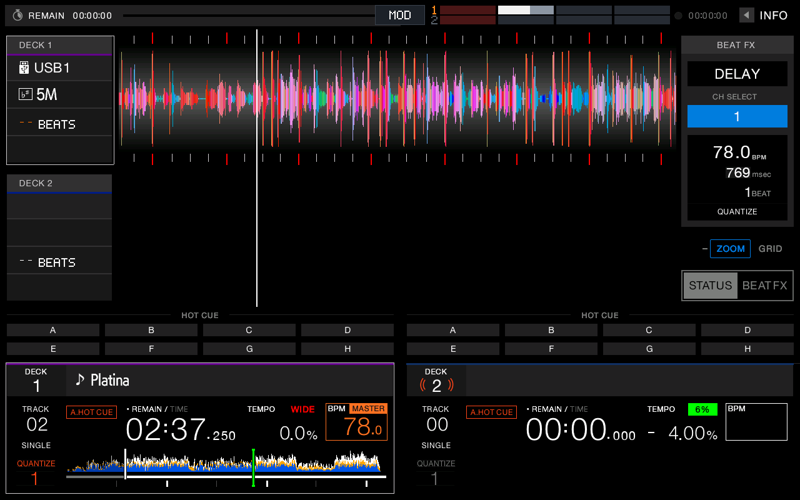
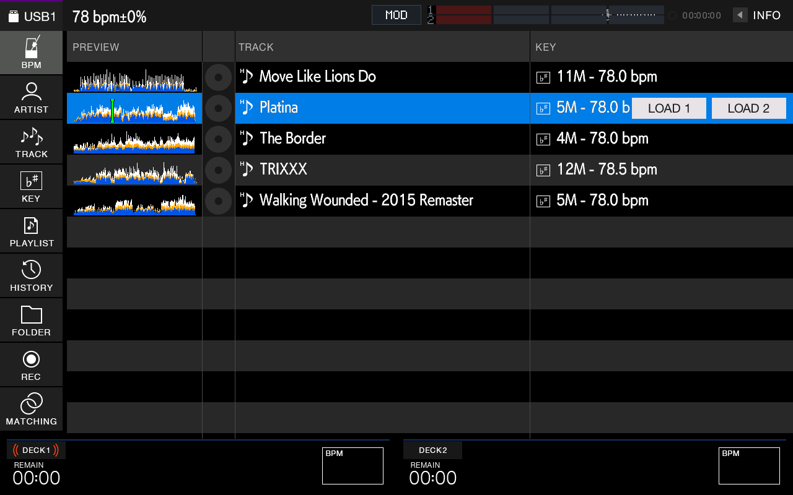

# 14 — Using the extras

A how-to for everything this fork adds on top of the stock port. Each item says what it does, how to use it on the unit, and where the details are. Nothing here needs SSH once the player is running.

**Jump to:** [MOD menu](#the-mod-menu) · [Memory cues](#memory-cues-slip-and-the-pad-page-arrows) · [Hot cue countdown](#the-hot-cue-countdown-deck-info-boxes) · [Beat meter](#beat-meter) · [SHIFT combos](#shift-combos) · [Touch Cue](#touch-cue) · [Track Preview](#track-preview)

## The MOD menu

Tap **MOD** at the top center of the screen. Tap anywhere outside the panel to close it.

* **Scroll:** the panel is taller than the screen. Drag your finger up or down inside it. The thin bar on its right edge shows where you are.
* **Tap a button** to use it. Buttons act when you lift your finger, so a drag never presses one by accident.
* **Green** means on or current.
* Settings marked "until reboot" in [08](08-controls.md#mod-menu) reset when the unit restarts.

## Memory cues: SLIP and the pad page arrows

Store and jump between memory cues without leaving the deck. rbp saves them to the stick like the RX3's MEMORY button, and draws a red ▼ marker on the waveform.

| Do this | Result |
|---|---|
| Press **SLIP** | Stores a memory cue at the playhead |
| Press the pad page **►** | Jumps to the next memory cue |
| Press the pad page **◄** | Jumps to the previous memory cue |
| Hold **SHIFT**, press **◄** | Deletes the memory cue at the playhead |
| Hold **SHIFT**, press **SLIP** | Slip mode (what SLIP used to do) |

Tips: jumping past the last or first cue does nothing. Call and delete work on the playhead, so jump to a cue first, then delete it. Details: [08 — Memory cues](08-controls.md#memory-cues).

## The hot cue countdown (deck info boxes)

The two boxes left of the waveforms (DECK 1 and DECK 2) show source, key, a countdown and the loop size. The countdown now counts to the **next hot cue (A–H)**, not the next memory cue. In the MOD menu, scroll to the last rows:

| Row | Buttons | What it does |
|---|---|---|
| **INFO** | OFF / ON | **ON** (default) is this fork's boxes. **OFF** gives them back to stock rbp: "USB1" shows, and the countdown goes back to memory cues. Use OFF to rule the fork out when something looks odd. |
| **ROWS** | SRC, KEY, CUE, LOOP | Show or hide each row. Green = shown. SRC (where the track came from, "USB1") starts hidden. A hidden row leaves an empty strip. |
| **COUNT** | BARS / BEATS | **BARS** reads like `02.3` (bars.beats). **BEATS** reads like `11 BEATS`. Over 99 beats it shows `--`. |

The countdown turns red in the last 16 beats (4 beats in BEATS mode). It shows `--.-` when no hot cue is ahead. Details: [06 — Deck info panel](06-display.md#deck-info-panel).

## Beat meter

A small meter in the top bar, right of MOD, with one row per deck. MOD row **BEAT**: **BARS** (default, shows where each deck is in its bar), **DRIFT** (how far the other deck is from the sync master) or **OFF**. Details: [08 — Beat meter](08-controls.md#beat-meter).

## SHIFT combos

Hold **SHIFT** and:

| Press | Result |
|---|---|
| a hot cue pad | deletes that hot cue |
| the jog wheel | searches through the track |
| the Beat FX TIME encoder | steps BEAT `<` / `>` in any encoder mode |
| the pad page **◄** | deletes the memory cue at the playhead |
| **SLIP** | slip mode |

### Beat jump on SEARCH < >

MOD row **SKIP** has two settings: **SEARCH** (the normal scan) and **LOOP SIZE**. With **LOOP SIZE**, each press of SEARCH `<` or `>` jumps the deck back or forward by the size the **loop encoder** is set to:

1. Turn the deck's loop encoder to a size (for example 4, 16 or 64 beats). The loop does not have to be running.
2. Press SEARCH `>` to jump forward that many beats, `<` to jump back.

Sizes: 128, 64, 32, 16, 8, 4, 2, 1 beats. At 1/2 beat and smaller the jump is 1/2 a beat. Details: [08 — SHIFT](08-controls.md#shift).

## Touch Cue

While a deck plays, **touch and hold its overview waveform** (the small full-track waveform in the deck panel at the bottom) to hear that point in the headphones. Slide to move the point, lift to stop. While holding, press a **pad** to set that hot cue at the previewed point. Turn it off with MOD row **TCUE**.

 Details: [08 — Touch Cue](08-controls.md#touch-cue).

## Track Preview

In the browse list, **touch a track's mini waveform** to hear it from that point in the headphones. A lime line shows the position. It needs MOD row **LINK** on (the default).

 Details: [08 — Track Preview](08-controls.md#track-preview).

## Safe to try

* **Memory cues and hot cues are written to your stick**, as with any rekordbox player. SHIFT + ◄ removes a memory cue you did not mean to make; SHIFT + pad removes a hot cue.
* **MOD menu settings last until reboot** unless the table in [08](08-controls.md#mod-menu) says otherwise.
* If the screen ever looks wrong, set **INFO** to **OFF** and open and close the MOD panel to force a full redraw.
